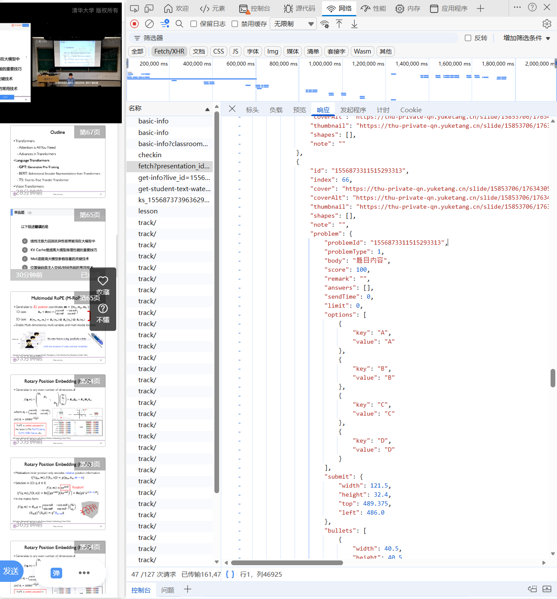
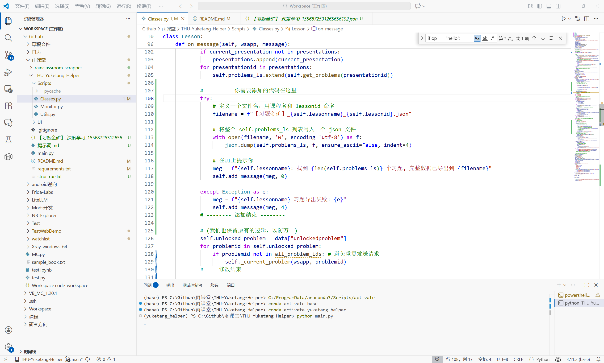

# 清华大学荷塘雨课堂助手
&emsp;&emsp;基于 *TrickyDeath* 的项目 [RainClassroomAssistant](https://github.com/TrickyDeath/RainClassroomAssitant) 进行修改，以专门适配清华大学的荷塘雨课堂。

## 功能
 - 自动签到
 - ~~自动答题（仅限于上课过程中发布的选择题、多选题、填空题）~~
 - 自动发弹幕（一定时间内收到一定数量的弹幕后，自动跟风发送相同内容的弹幕）
 - 点名、收到题目等情况下的语音提醒
 - 多线程支持（此脚本支持在有多个正在上课课程的情况下使用）
 - 简洁美观的UI
 
**经检查，由于荷塘雨课堂更新，前端无法获取题目答案，自动答题功能已失效。** 我们计划加入AI解题功能，敬请期待。

### 使用程序
&emsp;&emsp;已更新 Release v1.0.1，下载后双击打开即可使用！

## 我的改进（爬取当前课程未发布的习题地址！）

### 思路
得知可以爬取后按F12查看每个响应，找到响应，然后根据网上搜来的这个仓库丢给gemini分析API.



发现只要修改Scripts\Classes.py即可成功。


### 提交到仓库的流程
https://github.com/zhangchi2004/THU-Yuketang-Helper然后fork到自己
```bash
git remote -v
#重命名原作者的仓库为 "upstream" (上游),这一步是为了保留与原作者的联系，万一原作者更新了代码，你以后还可以同步。
git remote rename origin upstream
git remote add origin https://github.com/amithyst/THU-Yuketang-Helper.git
git remote -v


# 1. 添加修改的文件 ( . 代表所有文件)
git add .
# 2. 提交修改信息
git commit -m "修改了功能以爬取当前课程未发布的习题地址！" 
# 目前分支是main
git branch
# 3. 推送到你自己的远程仓库
git push -u origin main
```

### 安装与使用
```bash
git clone https://github.com/zhangchi2004/THU-Yuketang-Helper.git
cd THU-Yuketang-Helper
# 可以不用conda造虚拟环境，只要你能装的上依赖就行（可能需要管理员权限）
conda env list
conda create -n yuketang_helper python=3.11
conda activate yuketang_helper
pip install -r requirements.txt

python main.py

tree /F > structrue.txt #windows
conda deactivate
```

python main.py（懒得编译成exe）启动后就会爬取当前正在上课的课程中所有题目部分的图片并存储在【习题金矿】中（当然其他帧也可以爬取，就是懒得设置）
上课期间可以打开那些链接查看题目图片（当前课程结束就会失效！）